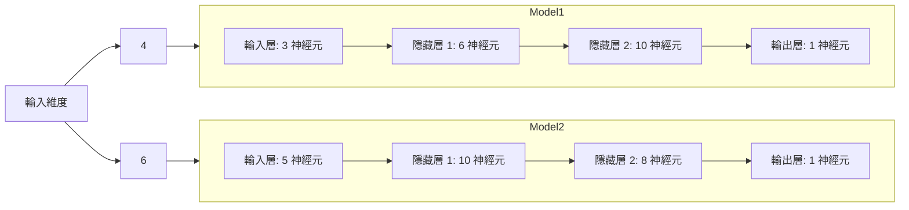

## mlp_autonomous_vehicle
Manually implemented an MLP and trained a model to enable a self-driving car to reach its destination, with the results presented through an interface.
### 使用語言及技術
Python、Tkinter、類神經網路、機器學習
### MLP架構

### 實作結果
demo: https://www.youtube.com/watch?v=7EDUYxnnots

#### 4維: 前方距離、右方距離、左方距離、方向盤得出角度 

#### 6維: X 座標、Y 座標、前方距離、右方距離、左方距離、方向盤得出角度

