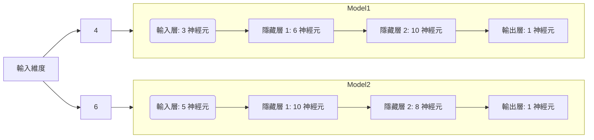

```mermaid
graph LR
    A[輸入維度] --> B[4]
    A --> C[6]

    subgraph Model2
				direction LR
        Input(輸入層: 5 神經元)
        Input --> Hidden1[隱藏層 1: 10 神經元]
        Hidden1 --> Hidden2[隱藏層 2: 8 神經元]
        Hidden2 --> Output[輸出層: 1 神經元]
    end

    subgraph Model1
				direction LR
        Input2(輸入層: 3 神經元)
        Input2 --> Hidden21[隱藏層 1: 6 神經元]
        Hidden21 --> Hidden22[隱藏層 2: 10 神經元]
        Hidden22 --> Output2[輸出層: 1 神經元]
    end

    B --> Model1
    C --> Model2
```
